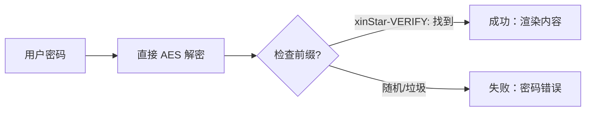

这个博客模板是用 [Astro](https://astro.build/) 构建的。对于本指南中未涉及的内容，您可以在 [Astro 文档](https://docs.astro.build/) 中找到答案。

## 文章前置数据

```yaml
---
title: My First Blog Post
published: 2023-09-09
description: This is the first post of my new Astro blog.
image: ./cover.jpg
tags: [Foo, Bar]
category: Front-end
draft: false
---
```


| 属性           | 描述                                                                                                                                                         |
| -------------- | ------------------------------------------------------------------------------------------------------------------------------------------------------------ |
| `title`        | 文章的标题。                                                                                                                                                 |
| `published`    | 文章发布的日期。                                                                                                                                             |
| `pinned`       | 这篇文章是否固定在文章列表的顶部。                                                                                                                           |
| `description`  | 文章的简短描述。在首页显示。                                                                                                                                 |
| `image`        | 文章的封面图片路径。<br/>1. 以 `http://` 或 `https://` 开头：使用网络图片<br/>2. 以 `/` 开头：用于 `public` 目录中的图片<br/>3. 无前缀：相对于 Markdown 文件 |
| `tags`         | 文章的标签。                                                                                                                                                 |
| `category`     | 文章的分类。                                                                                                                                                 |
| `alias`        | 文章的别名。文章可在 `/posts/{alias}/` 处访问。例如：`my-special-article`（将在 `/posts/my-special-article/` 处可用）                                        |
| `licenseName`  | 文章内容的许可证名称。                                                                                                                                       |
| `author`       | 文章的作者。                                                                                                                                                 |
| `sourceLink`   | 文章内容的源链接或参考。                                                                                                                                     |
| `draft`        | 这篇文章是否仍在草稿中，不会被显示。                                                                                                                         |
| `encrypted`    | 这篇文章是否受密码保护。                                                                                                                                     |
| `password`     | 解锁加密文章的密码。                                                                                                                                         |
| `passwordHint` | 帮助用户记住密码的提示。显示在密码输入框下方。                                                                                                               |

## 文章文件放置位置


您的文章文件应放在 `src/content/posts/` 目录中。您也可以创建子目录来更好地组织您的文章和资材。

```
src/content/posts/
├── post-1.md
└── post-2/
    ├── cover.png
    └── index.md
```

## 文章别名

您可以通过在前置数据中添加 `alias` 字段为任何文章设置别名：

```yaml
---
title: My Special Article
published: 2024-01-15
alias: "my-special-article"
tags: ["Example"]
category: "Technology"
---
```

设置别名时：
- 文章将在自定义 URL 处可访问（例如，`/posts/my-special-article/`）
- 默认的 `/posts/{slug}/` URL 仍将有效
- RSS/Atom 订阅源将使用自定义别名
- 所有内部链接将自动使用自定义别名

**重要提示：**
- 别名不应包含 `/posts/` 前缀（它将被自动添加）
- 避免在别名中使用特殊字符和空格
- 使用小写字母和连字符以获得最佳的 SEO 实践
- 确保别名在所有文章中是唯一的
- 不要包含前导或尾部斜杠


## 工作原理



## 页面加密

您可以通过在前置数据中设置 `encrypted: true` 并提供 `password` 来对任何文章进行密码保护：

```yaml
---
title: My Private Post
published: 2024-01-15
encrypted: true
password: "my-secret-password"
passwordHint: "Hint: The password is my dog's name"
---
```

### 字段

| 字段           | 必需 | 描述                                 |
| -------------- | ---- | ------------------------------------ |
| `encrypted`    | 是   | 设置为 `true` 以启用密码保护         |
| `password`     | 是   | 解锁文章的密码                       |
| `passwordHint` | 否   | 在密码输入框下方显示的提示，帮助用户 |

### 解锁框的外观

解锁框显示：
- 主题主色的锁定图标
- 文章标题"受密码保护"
- 要求输入密码的描述
- 提示（如果提供了 `passwordHint`）
- 密码输入字段和解锁按钮

输入正确的密码后，内容将被解密并显示。密码存储在会话存储中，因此用户不需要在同一会话中的后续页面加载时重新输入。
